# Decision Tree

# 1 决策树介绍

## 1.1 概念

  是一种树形归纳分类算法 ，通过对训练集数据的学习,挖掘出一定的规则， 用于对测试集数据进行预测。

## 1.2 结构

决策树由结点 (node) 和有向边 (directed edge) 组成。结点包含了一个根结点 (root node)、若干个内部结点 (internal node) 和若干个叶结点 (leaf node)。内部结点表示一个特征或属性，叶结点表示一个类别。

决策树是一个多层if-else函数，对对象属性进行多层if-else判断，获取目标属性的类别。由于只使用if-else对特征属性进行判断，所以一般特征属性为离散值，即使为连续值也会先进行区间离散化，如可以采用二分法（bi-partition）。

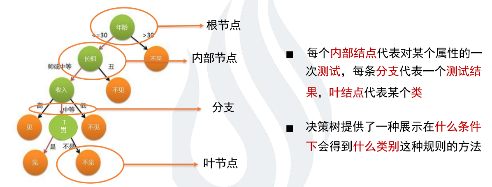

## 1.3 决策树特点

### 1.3.1 优点

　1）决策树易于理解和实现，人们在在学习过程中不需要使用者了解很多的背景知识，这同时是它的能够直接体现数据的特点，只要通过解释后都有能力去理解决策树所表达的意义。

　2）对于决策树，数据的准备往往是简单或者是不必要的，而且能够同时处理数据型和常规型属性，在相对短的时间内能够对大型数据源做出可行且效果良好的结果。

　3）易于通过静态测试来对模型进行评测，可以测定模型可信度；如果给定一个观察的模型，那么根据所产生的决策树很容易推出相应的逻辑表达式。

### 1.3.2 缺点

1）对连续性的字段比较难预测。

2）对有时间顺序的数据，需要很多预处理的工作。

3）当类别太多时，错误可能就会增加的比较快。

4）一般的算法分类的时候，只是根据一个字段来分类。

## 1.2 示例

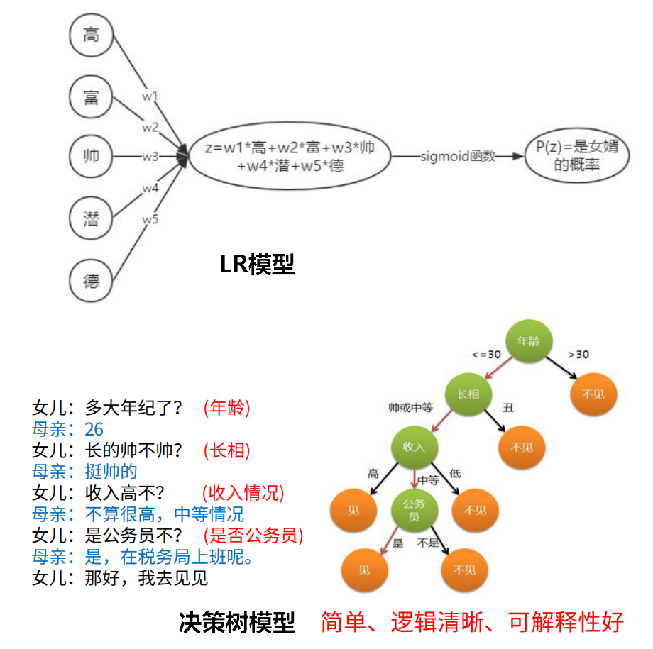

LR模型是一股脑儿的把所有特征塞入学习，而决策树更像是编程语言中的if-else一样，去做条件判断。

# 2 决策树分类

现有的关于决策树学习的主要思想主要包含以下 3 个研究成果：

* 由 Quinlan 在 1986 年提出的 **ID3 **算法，ID3算法以信息增益为准则来进行选择划分属性，选择信息增益最大的； 

* 由 Quinlan 在 1993 年提出的 **C4.5** 算法，C4.5算法先从候选划分属性中找出信息增益高于平均水平的属性，再从中选择增益率最高的；
* 由 Breiman 等人在 1984 年提出的 **CART** 算法， CART算法使用“基尼指数”来选择划分属性，选择基尼值最小的属性作为划分属性

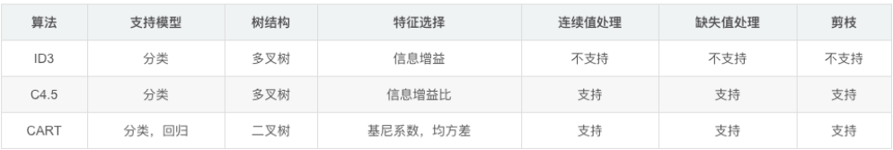


## 2.1 概念介绍

### 2.1.1 信息量

* 越不可能的事件发生了，我们获取到的信息量就越大；
* 越可能发生的事件发生了，我们获取到的信息量就越小。

> 事件A：巴西队进入了2018世界杯决赛圈。 
> 事件B：中国队进入了2018世界杯决赛圈。 
> 仅凭直觉来说，显而易见事件B的信息量比事件A的信息量要大

假设$X$是一个离散型随机变量，其取值集合为$χ$,概率分布函数$p(x)=P(X=x),x∈χ$，则定义事件$X=x_0$的信息量为：$I(x_0)=−log(p(x_0))$

对于某个事件，有n种可能性，每一种可能性都有一个概率 $p(x_i) $ ,这样就可以计算出某一种可能性的信息量。
>  假设你拿出了你的电脑，按下开关，会有三种可能性，下表列出了每一种可能的概率及其对应的信息量((式中对数一般取2为底)。

| 序号 | 事件         | 概率p | 信息量I         |
| :--- | :----------- | :---- | :-------------- |
| A    | 电脑正常开机 | 0.7   | -log(p(A))=0.36 |
| B    | 电脑无法开机 | 0.2   | -log(p(B))=1.61 |
| C    | 电脑爆炸了   | 0.1   | -log(p(C))=2.30 |

### 2.1.2 熵

**信息熵**：用来表示所有信息量的期望（随机变量的不确定性），信息熵越大越不确定，$H(X)=E(I(x_i))=	-\sum_{i=1}^np(x_i)log(p(x_i))$

**条件熵**：条件熵 H(Y|X) 表示在已知随机变量 X 的条件下随机变量 Y 的不确定性。

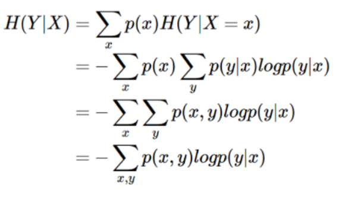


**KL散度**：度量两个分布的差异，也叫做相对熵，用来度量提议分布$q(x)$与真实分布$p(x)$的差距
$$
D_{KL}(p||q)=\sum_xp(x)log(\frac{p(x)}{q(x)})=\sum_xp(x)log(p(x))-\sum_xp(x)log(q(x))
$$
**交叉熵**：真实分布$p(x)$为常数，KL散度的后半部分称作交叉熵，公式是$-\sum_xp(x)\log q(x)$
$$
CrossEntropy=-y_i\log p_1-(1-y_i)\log p_0
$$

$$
Loss = \sum_{i=1}^my_i\cdot log(p_1)+(1-y_i)\cdot log(p_0)
$$

### 2.1.3 信息增益

**信息增益：** 度量以**某特征划分数据集前后的信息熵的差值**。 信息熵能够表示样本集合的不确定性，因此我们能够通过前后集合信息熵的差值来衡量使用当前特征对于样本集合D划分效果的好坏。
$$
信息熵：H(D) = - \sum_{k=1}^k \frac{|C_k|}{|D|} log_2 \frac{|C_k|}{|D|} \\
条件熵： H(D|A) = \sum_{i=1}^n \frac{|D_i|}{|D|} H(D_i) \\
信息增益： g(D,A)=H(D)-H(D|A)
$$

### 2.1.4 信息增益比

**信息增益比 = 惩罚参数 \* 信息增益**

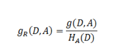

其中的$H_A(D)$，对于样本集合D，将当前特征A作为随机变量（取值是特征A的各个特征值），求得的经验熵(**之前是把集合类别作为随机变量，现在把某个特征作为随机变量，按照此特征的特征取值对集合D进行划分，计算熵$H_A(D)$**)。

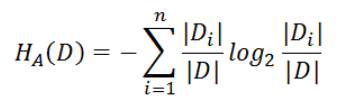

**信息增益比本质： 是在信息增益的基础之上乘上一个惩罚参数。特征个数较多时，惩罚参数较小；特征个数较少时，惩罚参数较大。**

**惩罚参数：数据集D以特征A作为随机变量的熵的倒数，即：将特征A取值相同的样本划分到同一个子集中（之前所说数据集的熵是依据类别进行划分的）**

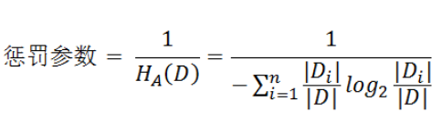

 缺点：信息增益比偏向取值较少的特征   

原因：  当特征取值较少时$H_A(D)$的值较小，因此其倒数较大，因而信息增益比较大。因而偏向取值较少的特征。

使用信息增益比：基于以上缺点，并不是直接选择信息增益率最大的特征，而是现在候选特征中找出信息增益高于平均水平的特征，然后在这些特征中再选择信息增益率最高的特征。   


### 2.1.5 基尼指数

**定义：**基尼指数（基尼不纯度）：表示在样本集合中一个随机选中的样本被分错的概率。

**注意**： Gini指数越小表示集合中被选中的样本被分错的概率越小，也就是说集合的纯度越高，反之，集合越不纯。即 **基尼指数（基尼不纯度）= 样本被选中的概率 \* 样本被分错的概率**

将熵定义式中的$-log(p_k)$替换为 $1-p_k $就是基尼系数。

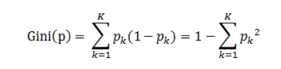

**说明:**

1. $p_k$表示选中的样本属于k类别的概率，则这个样本被分错的概率是$(1-p_k)$

2. 样本集合中有K个类别，一个随机选中的样本可以属于这k个类别中的任意一个，因而对类别就加和

3. 当为二分类是，Gini(P) = 2p(1-p)


## 2.2 计算示例

如下表共有17各数据样本，计“是否好瓜”这个变量为A，其中是好瓜样本数8个，不是好瓜样本数9个。

那么，是好瓜概率为8/17，不是好瓜的概率9/17。

​																						**西瓜数据集**

| 编号 | 色泽 | 根蒂 | 敲声 | 纹理 | 脐部 | 触感 | 密度  | 含糖率 | 是否好瓜 |
| ---- | ---- | ---- | ---- | ---- | ---- | ---- | ----- | ------ | -------- |
| 1    | 青绿 | 蜷缩 | 浊响 | 清晰 | 凹陷 | 硬滑 | 0.697 | 0.46   | 是       |
| 2    | 乌黑 | 蜷缩 | 沉闷 | 清晰 | 凹陷 | 硬滑 | 0.774 | 0.376  | 是       |
| 3    | 乌黑 | 蜷缩 | 浊响 | 清晰 | 凹陷 | 硬滑 | 0.634 | 0.264  | 是       |
| 4    | 青绿 | 蜷缩 | 沉闷 | 清晰 | 凹陷 | 硬滑 | 0.608 | 0.318  | 是       |
| 5    | 浅白 | 蜷缩 | 浊响 | 清晰 | 凹陷 | 硬滑 | 0.556 | 0.215  | 是       |
| 6    | 青绿 | 稍蜷 | 浊响 | 清晰 | 稍凹 | 软粘 | 0.403 | 0.237  | 是       |
| 7    | 乌黑 | 稍蜷 | 浊响 | 稍糊 | 稍凹 | 软粘 | 0.481 | 0.149  | 是       |
| 8    | 乌黑 | 稍蜷 | 浊响 | 清晰 | 稍凹 | 硬滑 | 0.437 | 0.211  | 是       |
| 9    | 乌黑 | 稍蜷 | 沉闷 | 稍糊 | 稍凹 | 硬滑 | 0.666 | 0.091  | 否       |
| 10   | 青绿 | 硬挺 | 清脆 | 清晰 | 平坦 | 软粘 | 0.243 | 0.267  | 否       |
| 11   | 浅白 | 硬挺 | 清脆 | 模糊 | 平坦 | 硬滑 | 0.245 | 0.057  | 否       |
| 12   | 浅白 | 蜷缩 | 浊响 | 模糊 | 平坦 | 软粘 | 0.343 | 0.099  | 否       |
| 13   | 青绿 | 稍蜷 | 浊响 | 稍糊 | 凹陷 | 硬滑 | 0.639 | 0.161  | 否       |
| 14   | 浅白 | 稍蜷 | 沉闷 | 稍糊 | 凹陷 | 硬滑 | 0.657 | 0.198  | 否       |
| 15   | 乌黑 | 稍蜷 | 浊响 | 清晰 | 稍凹 | 软粘 | 0.36  | 0.37   | 否       |
| 16   | 浅白 | 蜷缩 | 浊响 | 模糊 | 平坦 | 硬滑 | 0.593 | 0.042  | 否       |
| 17   | 青绿 | 蜷缩 | 沉闷 | 稍糊 | 稍凹 | 硬滑 | 0.719 | 0.103  | 否       |

### 2.2.1 信息熵计算

**信息熵**:$H(A)=-\frac{-8}{17}log_2\frac{8}{17}-\frac{9}{17}log_2\frac{9}{17} =0.9975$

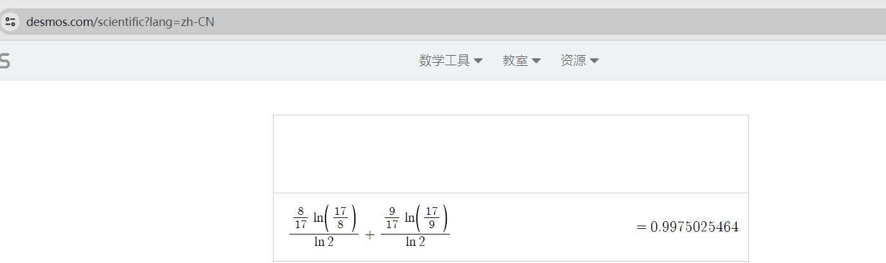

### 2.2.2 条件熵计算

现在引入“色泽”这个变量，来判断“是否好瓜”，降低判断是否好瓜的不确定性。在“色泽”这个条件下计算“是否好瓜”的熵，叫做**条件熵**。计“色泽”这个变量为B，那么**条件熵**的公式为：

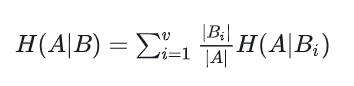

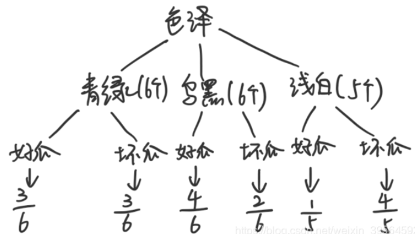

$H(A|B)=\frac{6}{17}(-\frac{3}{6}log_2\frac{3}{6}-\frac{3}{6}log_2\frac{3}{6})+\frac{6}{17}(-\frac{4}{6}log_2\frac{4}{6}-\frac{2}{6}log_2\frac{2}{6})+\frac{5}{17}(-\frac{1}{5}log_2\frac{1}{5}-\frac{4}{5}log_2\frac{4}{5})$

$H(A|B)=\frac{6}{17}\times1+\frac{6}{17} \times0.92+\frac{5}{17} \times0.72$

$H(A|B)=0.8894$

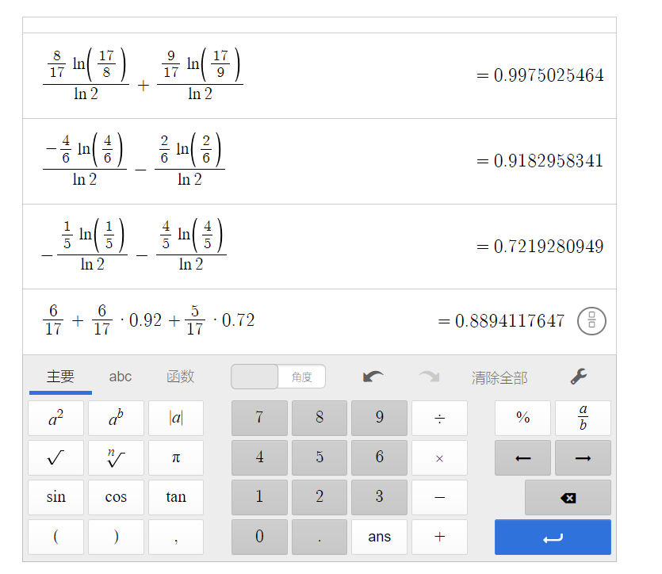

### 2.2.3 信息增益

$Gain(A,B) =H(A)-H(A|B)=0.9975-0.8894=0.1081$


### 2.2.4 信息增益比

$H(B)=−(\frac{6}{17}⋅log_2\frac{6}{17}+\frac{6}{17}⋅log_2\frac{6}{17}+\frac{5}{17}⋅log_2\frac{5}{17})=1.58$

$Gain\_ratio(A,B)= \frac{Gain(A,B)}{H(B)}=\frac{0.1081}{1.58}=0.068$

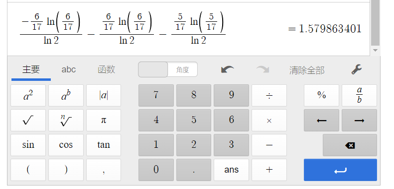


### 2.2.5 基尼指数


$Gini(色泽)=(1-2\times(\frac{3}{6})^2)+(1-(\frac{4}{6})^2-(\frac{2}{6})^2)+(1-(\frac{1}{5})^2-(\frac{4}{5})^2)$

$Gini(色泽)=\frac{1}{2}+\frac{4}{9}+\frac{8}{25}$

$Gini(色泽)=1.264$


```python
# 求取基尼值
def gini_index_single(a,b):
    single_gini = 1 - ((a/(a+b))**2) - ((b/(a+b))**2)
    return round(single_gini,4)

# 求取基尼指数
def gini_index(a,b,c,d,e,f):
    zuo = gini_index_single(a,b)
    zhong = gini_index_single(c,d)
    you = gini_index_single(e,f)
    sum = a+b+c+d+e+f
    gini_index = zuo*((a+b)/sum) + zhong*((c+d)/sum) + you*((e+f)/sum)
    return round(gini_index,4)

def gini_index2(a,b,c,d):
    zuo = gini_index_single(a,b)
    you = gini_index_single(c,d)
    sum = a+b+c+d
    gini_index2 = zuo*((a+b)/sum) + you*((c+d)/sum)
    return round(gini_index2,4)

```

计算器链接：https://www.desmos.com/scientific?lang=zh-CN