# Decision Tree

# 1 决策树介绍

## 1.1 概念

  是一种树形归纳分类算法 ，通过对训练集数据的学习,挖掘出一定的规则， 用于对测试集数据进行预测。

## 1.2 结构

决策树由结点 (node) 和有向边 (directed edge) 组成。结点包含了一个根结点 (root node)、若干个内部结点 (internal node) 和若干个叶结点 (leaf node)。内部结点表示一个特征或属性，叶结点表示一个类别。

决策树是一个多层if-else函数，对对象属性进行多层if-else判断，获取目标属性的类别。由于只使用if-else对特征属性进行判断，所以一般特征属性为离散值，即使为连续值也会先进行区间离散化，如可以采用二分法（bi-partition）。

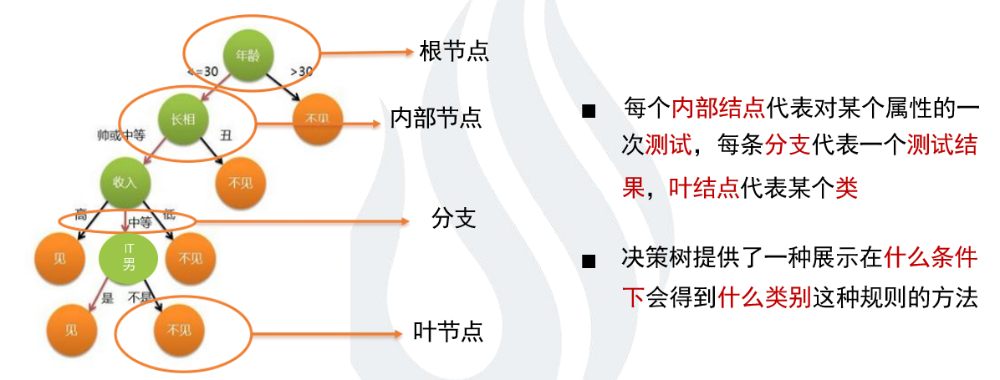

## 1.3 决策树特点

### 1.3.1 优点

　1）决策树易于理解和实现，人们在在学习过程中不需要使用者了解很多的背景知识，这同时是它的能够直接体现数据的特点，只要通过解释后都有能力去理解决策树所表达的意义。

　2）对于决策树，数据的准备往往是简单或者是不必要的，而且能够同时处理数据型和常规型属性，在相对短的时间内能够对大型数据源做出可行且效果良好的结果。

　3）易于通过静态测试来对模型进行评测，可以测定模型可信度；如果给定一个观察的模型，那么根据所产生的决策树很容易推出相应的逻辑表达式。

### 1.3.2 缺点

1）对连续性的字段比较难预测。

2）对有时间顺序的数据，需要很多预处理的工作。

3）当类别太多时，错误可能就会增加的比较快。

4）一般的算法分类的时候，只是根据一个字段来分类。

### 1.3.3 意义

- 每次都找不同的切分点，将样本空间逐渐进行细分，最后把属于同一类的空间进行合并，就形成了决策边界，树的层次越深，决策边界的切分就越细，区分越准确，同时也越有可能产生过拟合。
  - 决策树是一个预测模型；他代表的是对象属性与对象值之间的一种映射关系。树中每个节点表示某个对象，而每个分叉路径则代表的某个可能的属性值，而每个叶结点则对应从根节点到该叶节点所经历的路径所表示的对象的值。决策树仅有单一输出，若欲有复数输出，可以建立独立的决策树以处理不同输出。
  - 分支使用的是节点属性中的离散型数据，如果数据是连续型的，也需要转化成离散型数据才能在决策树中展示。
  - 决策树的路径具有一个重要的性质：互斥且完备,即每一个样本均被且只能被一条路径所覆盖。决策树学习算法主要由三部分构成：
    - 特征选择
    - 决策树生成
    - 决策树的剪枝

## 1.4 决策树构建

决策树的建立 开始，构建根节点，将所有训练数据放在根节点，选择一个最优特征，按照这一特征的取值将训练数据分割为子集，使各个子集有一个当前条件下最好的分类。如果这些子集能被基本正确分类，那么构造叶节点，将对应子集集中到叶节点。如果有子集不能被正确分类，那么就这些子集选择新的最优特征，继续对其进行分割，构建相应的节点。递归进行上述的操作，直到所有训练数据子集均能被正确分类。

- 节点分裂：一般当一个节点所代表的属性无法给出判断时，则选择将这一节点分成2个子节点（如不是二叉树的情况会分成n个子节点）
- 阈值的确定，选择适当的阈值使得分类错误率最小。

## 1.5 示例

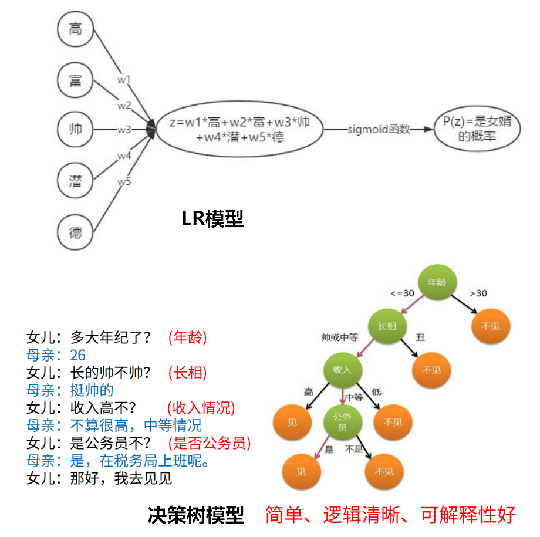

LR模型是一股脑儿的把所有特征塞入学习，而决策树更像是编程语言中的if-else一样，去做条件判断。

# 2 决策树分类

现有的关于决策树学习的主要思想主要包含以下 3 个研究成果：

* 由 Quinlan 在 1986 年提出的 **ID3 **算法，ID3算法以信息增益为准则来进行选择划分属性，选择信息增益最大的； 

* 由 Quinlan 在 1993 年提出的 **C4.5** 算法，C4.5算法先从候选划分属性中找出信息增益高于平均水平的属性，再从中选择增益率最高的；
* 由 Breiman 等人在 1984 年提出的 **CART** 算法， CART算法使用“基尼指数”来选择划分属性，选择基尼值最小的属性作为划分属性

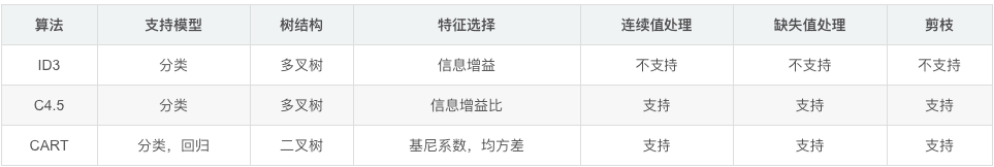


## 2.1 概念介绍

### 2.1.1 信息量

* 越不可能的事件发生了，我们获取到的信息量就越大；
* 越可能发生的事件发生了，我们获取到的信息量就越小。

> 事件A：巴西队进入了2018世界杯决赛圈。 
> 事件B：中国队进入了2018世界杯决赛圈。 
> 仅凭直觉来说，显而易见事件B的信息量比事件A的信息量要大

假设$X$是一个离散型随机变量，其取值集合为$χ$,概率分布函数$p(x)=P(X=x),x∈χ$，则定义事件$X=x_0$的信息量为：$I(x_0)=−log(p(x_0))$

对于某个事件，有n种可能性，每一种可能性都有一个概率 $p(x_i) $ ,这样就可以计算出某一种可能性的信息量。
>  假设你拿出了你的电脑，按下开关，会有三种可能性，下表列出了每一种可能的概率及其对应的信息量((式中对数一般取2为底)。

| 序号 | 事件         | 概率p | 信息量I         |
| :--- | :----------- | :---- | :-------------- |
| A    | 电脑正常开机 | 0.7   | -log(p(A))=0.36 |
| B    | 电脑无法开机 | 0.2   | -log(p(B))=1.61 |
| C    | 电脑爆炸了   | 0.1   | -log(p(C))=2.30 |

### 2.1.2 熵

**信息熵**：用来表示所有信息量的期望（随机变量的不确定性），信息熵越大越不确定，$H(X)=E(I(x_i))=	-\sum_{i=1}^np(x_i)log(p(x_i))$

**条件熵**：条件熵 H(Y|X) 表示在已知随机变量 X 的条件下随机变量 Y 的不确定性。

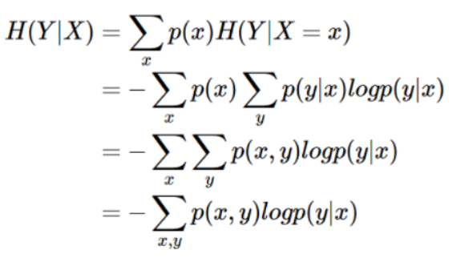


**KL散度**：度量两个分布的差异，也叫做相对熵，用来度量提议分布$q(x)$与真实分布$p(x)$的差距
$$
D_{KL}(p||q)=\sum_xp(x)log(\frac{p(x)}{q(x)})=\sum_xp(x)log(p(x))-\sum_xp(x)log(q(x))
$$
**交叉熵**：真实分布$p(x)$为常数，KL散度的后半部分称作交叉熵，公式是$-\sum_xp(x)\log q(x)$
$$
CrossEntropy=-y_i\log p_1-(1-y_i)\log p_0
$$

$$
Loss = \sum_{i=1}^my_i\cdot log(p_1)+(1-y_i)\cdot log(p_0)
$$

### 2.1.3 信息增益

**信息增益：** 度量以**某特征划分数据集前后的信息熵的差值**。 信息熵能够表示样本集合的不确定性，因此我们能够通过前后集合信息熵的差值来衡量使用当前特征对于样本集合D划分效果的好坏。
$$
信息熵：H(D) = - \sum_{k=1}^k \frac{|C_k|}{|D|} log_2 \frac{|C_k|}{|D|} \\
条件熵： H(D|A) = \sum_{i=1}^n \frac{|D_i|}{|D|} H(D_i) \\
信息增益： g(D,A)=H(D)-H(D|A)
$$

### 2.1.4 信息增益比

**信息增益比 = 惩罚参数 \* 信息增益**

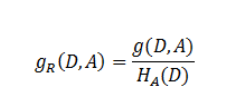

其中的$H_A(D)$，对于样本集合D，将当前特征A作为随机变量（取值是特征A的各个特征值），求得的经验熵(**之前是把集合类别作为随机变量，现在把某个特征作为随机变量，按照此特征的特征取值对集合D进行划分，计算熵$H_A(D)$**)。

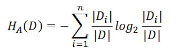

**信息增益比本质： 是在信息增益的基础之上乘上一个惩罚参数。特征个数较多时，惩罚参数较小；特征个数较少时，惩罚参数较大。**

**惩罚参数：数据集D以特征A作为随机变量的熵的倒数，即：将特征A取值相同的样本划分到同一个子集中（之前所说数据集的熵是依据类别进行划分的）**

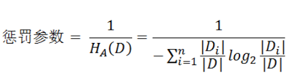

 缺点：信息增益比偏向取值较少的特征   

原因：  当特征取值较少时$H_A(D)$的值较小，因此其倒数较大，因而信息增益比较大。因而偏向取值较少的特征。

使用信息增益比：基于以上缺点，并不是直接选择信息增益率最大的特征，而是现在候选特征中找出信息增益高于平均水平的特征，然后在这些特征中再选择信息增益率最高的特征。   


### 2.1.5 基尼指数

**定义：**基尼指数（基尼不纯度）：表示在样本集合中一个随机选中的样本被分错的概率。

**注意**： **Gini指数越小**表示集合中被选中的样本被分错的概率越小，也就是说**集合的纯度越高**，反之，集合越不纯。即 **基尼指数（基尼不纯度）= 样本被选中的概率 \* 样本被分错的概率**

将熵定义式中的$-log(p_k)$替换为 $1-p_k $就是基尼系数。

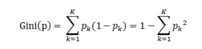

**说明:**

1. $p_k$表示选中的样本属于k类别的概率，则这个样本被分错的概率是$(1-p_k)$

2. 样本集合中有K个类别，一个随机选中的样本可以属于这k个类别中的任意一个，因而对类别就加和

3. 当为二分类是，Gini(P) = 2p(1-p)


## 2.2 计算示例

如下表共有17各数据样本，计“是否好瓜”这个变量为A，其中是好瓜样本数8个，不是好瓜样本数9个。

那么，是好瓜概率为8/17，不是好瓜的概率9/17。

​																						**西瓜数据集**

| 编号 | 色泽 | 根蒂 | 敲声 | 纹理 | 脐部 | 触感 | 密度  | 含糖率 | 是否好瓜 |
| ---- | ---- | ---- | ---- | ---- | ---- | ---- | ----- | ------ | -------- |
| 1    | 青绿 | 蜷缩 | 浊响 | 清晰 | 凹陷 | 硬滑 | 0.697 | 0.46   | 是       |
| 2    | 乌黑 | 蜷缩 | 沉闷 | 清晰 | 凹陷 | 硬滑 | 0.774 | 0.376  | 是       |
| 3    | 乌黑 | 蜷缩 | 浊响 | 清晰 | 凹陷 | 硬滑 | 0.634 | 0.264  | 是       |
| 4    | 青绿 | 蜷缩 | 沉闷 | 清晰 | 凹陷 | 硬滑 | 0.608 | 0.318  | 是       |
| 5    | 浅白 | 蜷缩 | 浊响 | 清晰 | 凹陷 | 硬滑 | 0.556 | 0.215  | 是       |
| 6    | 青绿 | 稍蜷 | 浊响 | 清晰 | 稍凹 | 软粘 | 0.403 | 0.237  | 是       |
| 7    | 乌黑 | 稍蜷 | 浊响 | 稍糊 | 稍凹 | 软粘 | 0.481 | 0.149  | 是       |
| 8    | 乌黑 | 稍蜷 | 浊响 | 清晰 | 稍凹 | 硬滑 | 0.437 | 0.211  | 是       |
| 9    | 乌黑 | 稍蜷 | 沉闷 | 稍糊 | 稍凹 | 硬滑 | 0.666 | 0.091  | 否       |
| 10   | 青绿 | 硬挺 | 清脆 | 清晰 | 平坦 | 软粘 | 0.243 | 0.267  | 否       |
| 11   | 浅白 | 硬挺 | 清脆 | 模糊 | 平坦 | 硬滑 | 0.245 | 0.057  | 否       |
| 12   | 浅白 | 蜷缩 | 浊响 | 模糊 | 平坦 | 软粘 | 0.343 | 0.099  | 否       |
| 13   | 青绿 | 稍蜷 | 浊响 | 稍糊 | 凹陷 | 硬滑 | 0.639 | 0.161  | 否       |
| 14   | 浅白 | 稍蜷 | 沉闷 | 稍糊 | 凹陷 | 硬滑 | 0.657 | 0.198  | 否       |
| 15   | 乌黑 | 稍蜷 | 浊响 | 清晰 | 稍凹 | 软粘 | 0.36  | 0.37   | 否       |
| 16   | 浅白 | 蜷缩 | 浊响 | 模糊 | 平坦 | 硬滑 | 0.593 | 0.042  | 否       |
| 17   | 青绿 | 蜷缩 | 沉闷 | 稍糊 | 稍凹 | 硬滑 | 0.719 | 0.103  | 否       |

### 2.2.1 信息熵计算

**信息熵**:$H(A)=-\frac{-8}{17}log_2\frac{8}{17}-\frac{9}{17}log_2\frac{9}{17} =0.9975$

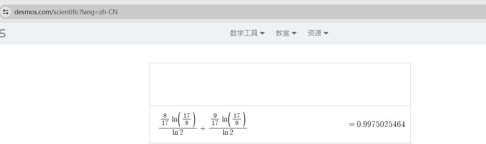

### 2.2.2 条件熵计算

现在引入“色泽”这个变量，来判断“是否好瓜”，降低判断是否好瓜的不确定性。在“色泽”这个条件下计算“是否好瓜”的熵，叫做**条件熵**。计“色泽”这个变量为B，那么**条件熵**的公式为：

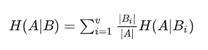

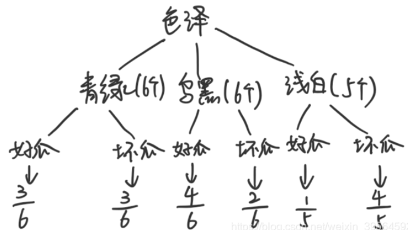

$H(A|B)=\frac{6}{17}(-\frac{3}{6}log_2\frac{3}{6}-\frac{3}{6}log_2\frac{3}{6})+\frac{6}{17}(-\frac{4}{6}log_2\frac{4}{6}-\frac{2}{6}log_2\frac{2}{6})+\frac{5}{17}(-\frac{1}{5}log_2\frac{1}{5}-\frac{4}{5}log_2\frac{4}{5})$

$H(A|B)=\frac{6}{17}\times1+\frac{6}{17} \times0.92+\frac{5}{17} \times0.72$

$H(A|B)=0.8894$

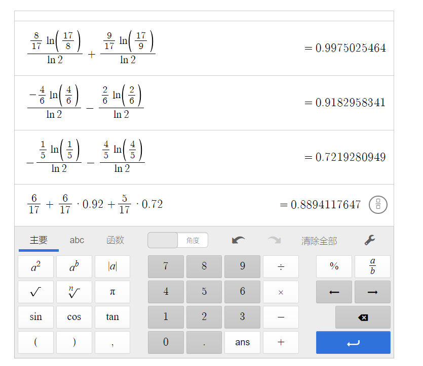

### 2.2.3 信息增益

$Gain(A,B) =H(A)-H(A|B)=0.9975-0.8894=0.1081$


### 2.2.4 信息增益比

$H(B)=−(\frac{6}{17}⋅log_2\frac{6}{17}+\frac{6}{17}⋅log_2\frac{6}{17}+\frac{5}{17}⋅log_2\frac{5}{17})=1.58$

$Gain\_ratio(A,B)= \frac{Gain(A,B)}{H(B)}=\frac{0.1081}{1.58}=0.068$

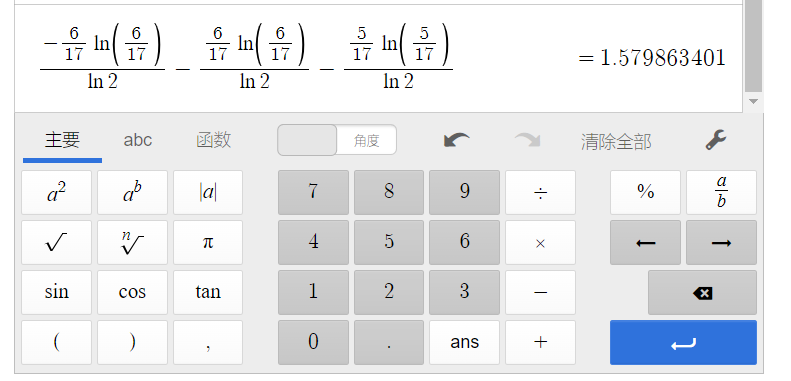


### 2.2.5 基尼指数计算


$Gini(青绿)=1-2\times(\frac{3}{6})^2=\frac{1}{2}$

$Gini(乌黑)=1-(\frac{4}{6})^2-(\frac{2}{6})^2=\frac{4}{9}$

$Gini(浅白)=1-(\frac{1}{5})^2-(\frac{4}{5})^2=\frac{8}{25}$

$Gini(色泽)=\frac{6}{17}\times\frac{1}{2}+\frac{6}{17}\times\frac{4}{9}+\frac{5}{17}\times\frac{8}{25}$

$Gini(色泽)=0.427$

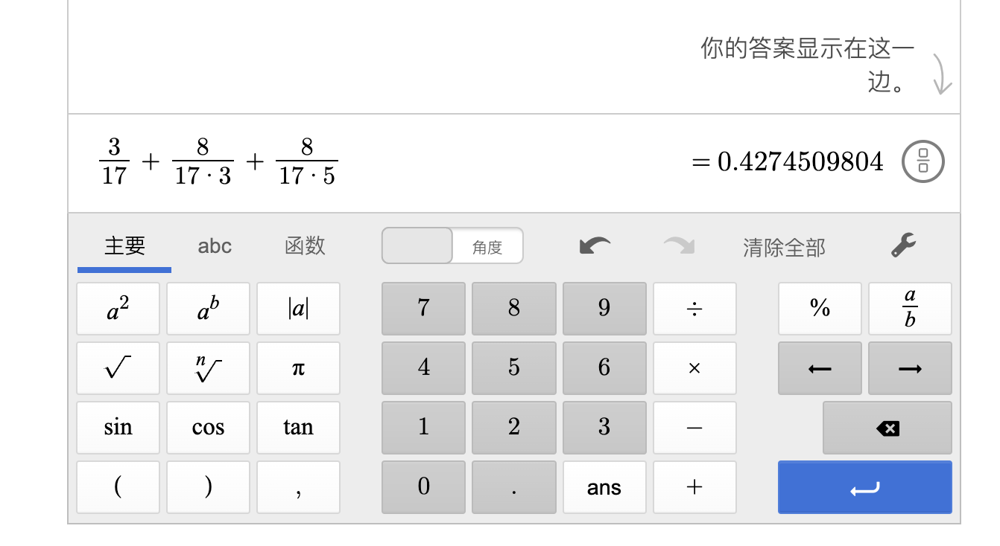

```python
# 求取基尼值
def gini_index_single(a,b):
    single_gini = 1 - ((a/(a+b))**2) - ((b/(a+b))**2)
    return round(single_gini,4)

# 求取基尼指数
def gini_index(a,b,c,d,e,f):
    zuo = gini_index_single(a,b)
    zhong = gini_index_single(c,d)
    you = gini_index_single(e,f)
    sum = a+b+c+d+e+f
    gini_index = zuo*((a+b)/sum) + zhong*((c+d)/sum) + you*((e+f)/sum)
    return round(gini_index,4)

def gini_index2(a,b,c,d):
    zuo = gini_index_single(a,b)
    you = gini_index_single(c,d)
    sum = a+b+c+d
    gini_index2 = zuo*((a+b)/sum) + you*((c+d)/sum)
    return round(gini_index2,4)

```


## 2.3 三种决策树

### 2.3.1ID3

ID3算法的核心是在决策树的各个结点上应用信息增益准则进行特征选择。具体做法是：

- 从根节点开始，对结点计算所有可能特征的信息增益，选择信息增益最大的特征作为结点的特征，并由该特征的不同取值构建子节点；
- 对子节点递归地调用以上方法，构建决策树；
- 直到所有特征的信息增益均很小或者没有特征可选时为止。

```text
判断数据集中的每个子项是否属于同一类：
    if true:
        return 类标签；
    else:
        寻找划分数据集的最佳特征
        根据最佳特征划分数据集
        创建分支节点
        for 每个划分的子集
            递归调用createBranch();
        return 分支节点
```

```python
#计算信息熵
def calc_ent(datasets):
    data_length = len(datasets)
    label_count = {}
    for i in range(data_length):
        label = datasets[i][-1]
        if label not in label_count:
            label_count[label] = 0
        label_count[label] += 1
    ent = -sum([(p / data_length) * log(p / data_length, 2)
                for p in label_count.values()])
    return ent
```

```python
#计算条件熵
def cond_ent(datasets, axis=0):
    data_length = len(datasets)
    feature_sets = {}
    for i in range(data_length):
        feature = datasets[i][axis]
        if feature not in feature_sets:
            feature_sets[feature] = []
        feature_sets[feature].append(datasets[i])
    cond_ent = sum(
        [(len(p) / data_length) * calc_ent(p) for p in feature_sets.values()])
    return cond_ent

#计算信息增益
def info_gain(ent, cond_ent):
    return ent - cond_ent
```


```python
def ID3_chooseBestFeature(dataset):
    numFeatures = len(dataset[0]) - 1
    baseEnt = cal_entropy(dataset)
    bestInfoGain = 0.0
    bestFeature = -1
    for i in range(numFeatures):  # check all features
        featList = [example[i] for example in dataset]
        uniqueVals = set(featList)
        newEnt = 0.0
        # claculate entropy of every divide ways
        for value in uniqueVals:
            # choose the samples mmeeting the requirement
            subdataset = splitdataset(dataset, i, value)
            p = len(subdataset) / float(len(dataset))
            newEnt += p * cal_entropy(subdataset)
        infoGain = baseEnt - newEnt

        if (infoGain > bestInfoGain):
            bestInfoGain = infoGain  # choose the largest information gain
            bestFeature = i
    return bestFeature
```


### 2.3.2 C4.5

C4.5 算法更换了特征选择的标准，使用信息增益比进行特征选择。不直接选择增益率最大的候选划分属性，候选划分属性中找出信息增益高于平均水平的属性（这样保证了大部分好的的特征），再从中选择增益率最高的（又保证了不会出现编号特征这种极端的情况） 对于连续值属性来说，可取值数目不再有限，因此可以采用离散化技术（如二分法）进行处理。将属性值从小到大排序，然后选择中间值作为分割点，数值比它小的点被划分到左子树，数值不小于它的点被分到又子树，计算分割的信息增益率，选择信息增益率最大的属性值进行分割。

```text
Function C4.5(R:包含连续属性的无类别属性集合,C:类别属性,S:训练集)  
/*返回一棵决策树*/  
Begin  
   If S 为空,返回一个值为 Failure 的单个节点;  
   If S 是由相同类别属性值的记录组成：  
      返回一个带有该值的单个节点;  
   If R 为空,则返回一个单节点,其值为在 S 的记录中找出的频率最高的类别属性值;  
   [注意未出现错误则意味着是不适合分类的记录]；  
  For 所有的属性 R(Ri) Do  
        If 属性 Ri 为连续属性，则  
     Begin  
           将Ri的最小值赋给 A1：  
        将Rm的最大值赋给Am；/*m值手工设置*/  
           For j From 2 To m-1 Do Aj=A1+j*(A1Am)/m;  
           将 Ri 点的基于{< =Aj,>Aj}的最大信息增益属性 (Ri,S) 赋给 A；  
     End；  
  将 R 中属性之间具有最大信息增益的属性 (D,S) 赋给 D;  
   将属性D的值赋给{dj/j=1,2...m}；  
  将分别由对应于 D 的值为 dj 的记录组成的S的子集赋给 {sj/j=1,2...m};  
   返回一棵树，其根标记为 D;树枝标记为 d1,d2...dm;  
   再分别构造以下树:  
   C4.5(R-{D},C,S1),C4.5(R-{D},C,S2)...C4.5(R-{D},C,Sm);  

End C4.5
```

```python
def C45_chooseBestFeatureToSplit(dataset):
    numFeatures = len(dataset[0]) - 1
    baseEnt = cal_entropy(dataset)
    bestInfoGain_ratio = 0.0
    bestFeature = -1
    for i in range(numFeatures):  # check every feature
        featList = [example[i] for example in dataset]
        uniqueVals = set(featList)
        newEnt = 0.0
        IV = 0.0
        for value in uniqueVals:
            subdataset = splitdataset(dataset, i, value)
            p = len(subdataset) / float(len(dataset))
            newEnt += p * cal_entropy(subdataset)
            IV = IV - p * log(p, 2)
        infoGain = baseEnt - newEnt
        if (IV == 0):
            continue
        infoGain_ratio = infoGain / IV  # infoGain_ratio of current feature

        if (infoGain_ratio > bestInfoGain_ratio):  # choose the greatest gain ratio
            bestInfoGain_ratio = infoGain_ratio
            bestFeature = i  # choose the feature corsbounding to the gain ratio
    return bestFeature
```


### 2.3.3 CART

CART中用于选择变量的不纯性度量是Gini指数； 如果目标变量是标称的，并且是具有两个以上的类别，则CART可能考虑将目标类别合并成两个超类别（双化）； 如果目标变量是连续的，则CART算法找出一组基于树的回归方程来预测目标变量。

相比ID3和C4.5，CART应用要多一些，既可以用于分类也可以用于回归。CART分类时，使用基尼指数（Gini）来选择最好的数据分割的特征，gini描述的是纯度，与信息熵的含义相似。CART中每一次迭代都会降低GINI系数。

```text
算法流程：

CART回归树预测回归连续型数据，假设X与Y分别是输入和输出变量，并且Y是连续变量。在训练数据集所在的输入空间中，递归的将每个区域划分为两个子区域并决定每个子区域上的输出值，构建二叉决策树。
选择最优切分变量j与切分点 
：遍历变量 
，对规定的切分变量 
 扫描切分点 
，选择使下式得到最小值时的 
 对。其中 
 是被划分的输入空间，$c_m$ 是空间 
 对应的固定输出值。
用选定的 
 对，划分区域并决定相应的输出值。
继续对两个子区域调用上述步骤，将输入空间划分为 
 个区域 
，生成决策树。
当输入空间划分确定时，可以用平方误差来表示回归树对于训练数据的预测方法，用平方误差最小的准则求解每个单元上的最优输出值。

```

```python
def CART_chooseBestFeature(dataset):
    numFeatures = len(dataset[0]) - 1  # except the column of labels
    bestGini = 999999.0
    bestFeature = -1  # default label

    for i in range(numFeatures):
        featList = [example[i] for example in dataset]
        uniqueVals = set(featList)  # get the possible values of each feature
        gini = 0.0

        for value in uniqueVals:
            subdataset = splitdataset(dataset, i, value)
            p = len(subdataset) / float(len(dataset))
            subp = len(splitdataset(subdataset, -1, '0')) / float(len(subdataset))
        gini += p * (1.0 - pow(subp, 2) - pow(1 - subp, 2))

        if (gini < bestGini):
            bestGini = gini
            bestFeature = i

    return bestFeature
```


# 3 剪枝

为了避免决策树“过拟合”样本。前面的算法生成的决策树非常的详细而庞大，每个属性都被详细地加以考虑，决策树的树叶节点所覆盖的训练样本都是“纯”的。因此用这个决策树来对训练样本进行分类的话，你会发现对于训练样本而言，这个树表现堪称完美，它可以100%完美正确得对训练样本集中的样本进行分类（因为决策树本身就是100%完美拟合训练样本的产物）。但是，这会带来一个问题，如果训练样本中包含了一些错误，按照前面的算法，这些错误也会100%一点不留得被决策树学习了，这就是“过拟合”。

## 3.1预剪枝 pre-pruning

预剪枝就是在树的构建过程（只用到训练集），设置一个阈值（样本个数小于预定阈值或GINI指数小于预定阈值），使得当在当前分裂节点中分裂前和分裂后的误差超过这个阈值则分列，否则不进行分裂操作。所有决策树的构建方法，都是在无法进一步降低熵的情况下才会停止创建分支的过程，为了避免过拟合，可以设定一个阈值，熵减小的数量小于这个阈值，即使还可以继续降低熵，也停止继续创建分支。但是这种方法实际中的效果并不好。 在划分之前，所有样本集中于根节点，若不进行划分，该节点被标记为叶节点，其类别标记为训练样例最多的类别。若进行划分在测试集上的准确率小于在根节点不进行划分的准确率，或增幅没有超过阈值，都不进行划分，作为一个叶节点返回当前数据集中最多的标签类型。

- 预剪枝就是在完全正确分类训练集之前，较早地停止树的生长。 具体在什么时候停止决策树的生长有多种不同的方法:
  1. 一种最为简单的方法就是在决策树到达一定高度的情况下就停止树的生长。
  2. 到达此结点的实例具有相同的特征向量，而不必一定属于同一类， 也可停止生长。
  3. 到达此结点的实例个数小于某一个阈值也可停止树的生长。
  4. 还有一种更为普遍的做法是计算每次扩张对系统性能的增益，如果这个增益值小于某个阈值则不进行扩展。
- 优点：快速，可以在构建决策树时进行剪枝，显著降低了过拟合风险。由于预剪枝不必生成整棵决策树，且算法相对简单，效率很高，适合解决大规模问题。但是尽管这一方法看起来很直接， 但是怎样精确地估计何时停止树的增长是相当困难的。
- 缺点：预剪枝基于贪心思想，本质上禁止分支展开，给决策树带来了欠拟合的风险。因为视野效果问题 。 也就是说在相同的标准下，也许当前的扩展会造成过度拟合训练数据，但是更进一步的扩展能够满足要求，也有可能准确地拟合训练数据。这将使得算法过早地停止决策树的构造。


```python
if pre_pruning:
    ans = []
    for index in range(len(test_dataset)):  # build label for test dataset
        ans.append(test_dataset[index][-1])
    result_counter = Counter()
    for vec in dataset:
        result_counter[vec[-1]] += 1
    # what will it be if it is a leaf node
    leaf_output = result_counter.most_common(1)[0][0]
    root_acc = cal_acc(test_output=[leaf_output] * len(test_dataset),
                        label=ans)
    outputs = []
    ans = []
    for value in uniqueVals:  # expand the node
        cut_testset = splitdataset(test_dataset, bestFeat, value)
        cut_dataset = splitdataset(dataset, bestFeat, value)
        for vec in cut_testset:
            ans.append(vec[-1])
        result_counter = Counter()
        for vec in cut_dataset:
            result_counter[vec[-1]] += 1
        leaf_output = result_counter.most_common(1)[0][0]  # what will it be if it is a leaf node
        outputs += [leaf_output] * len(cut_testset)
    cut_acc = cal_acc(test_output=outputs, label=ans)

    if cut_acc <= root_acc + threshold: # whether expand the node or not
        return leaf_output
```


## 3.2 后剪枝 post-pruning

决策树构造完成后进行剪枝。剪枝的过程是对拥有同样父节点的一组节点进行检查，判断如果将其合并，熵的增加量是否小于某一阈值。如果确实小，则这一组节点可以合并一个节点，其中包含了所有可能的结果。后剪枝是目前最普遍的做法。 后剪枝的剪枝过程是删除一些子树，然后用其叶子节点代替，这个叶子节点所标识的类别通过大多数原则 (majority class criterion) 确定。所谓大多数原则，是指剪枝过程中, 将一些子树删除而用叶节点代替,这个叶节点所标识的类别用这棵子树中大多数训练样本所属的类别来标识。相比于前剪枝，后剪枝方法更常用，是因为在前剪枝方法中精确地估计何时停止树增长很困难。

- 优点：欠拟合风险小，泛化性能好
- 缺点：在生成决策树之后完成，自底向上对所有非叶节点进行逐一考察，训练的时间开销较大

```python

def prune_tree(node, prunedList):
    # Base case: we've reached a leaf
    if isinstance(node, Leaf):
        return node
    # If we reach a pruned node, make that node a leaf node and return.
    # Since it becomes a leaf node, the nodes
    # below it are automatically not considered
    if int(node.id) in prunedList:
        return Leaf(node.rows, node.id, node.depth)

    # Call this function recursively on the true branch
    node.true_branch = prune_tree(node.true_branch, prunedList)

    # Call this function recursively on the false branch
    node.false_branch = prune_tree(node.false_branch, prunedList)

    return node
```


# Reference

* 计算器链接：https://www.desmos.com/scientific?lang=zh-CN